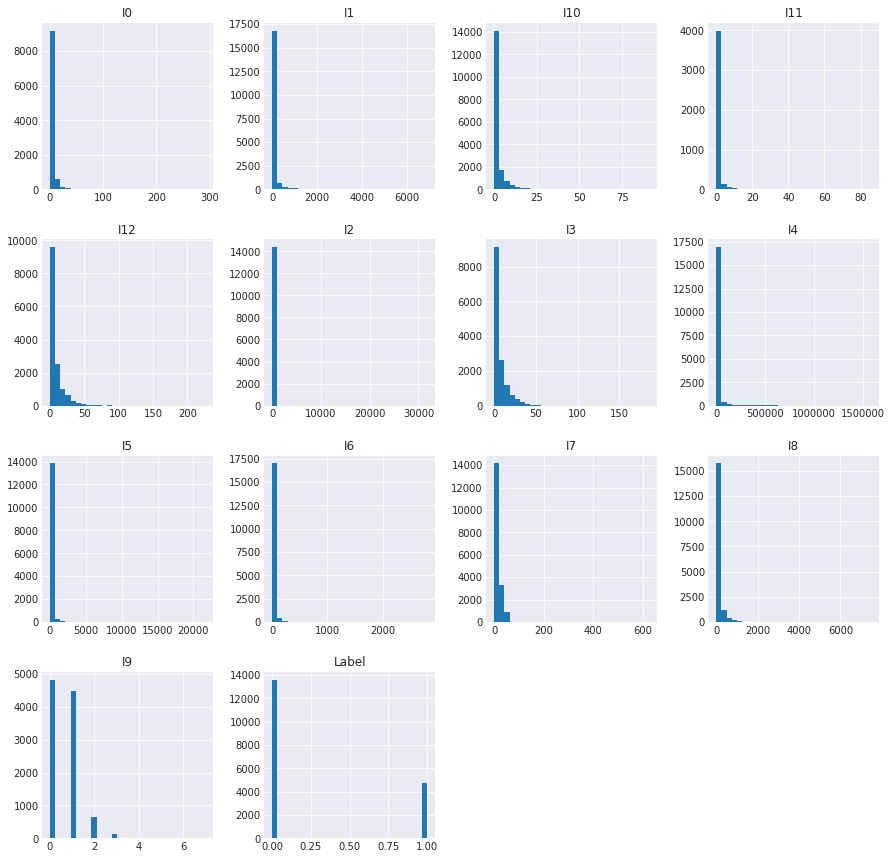
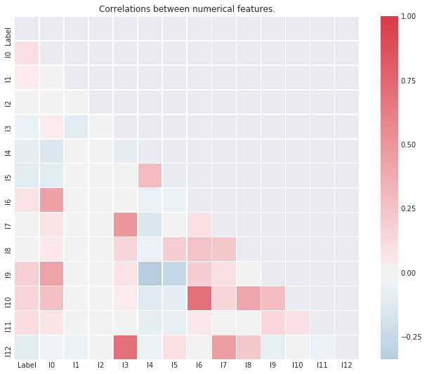
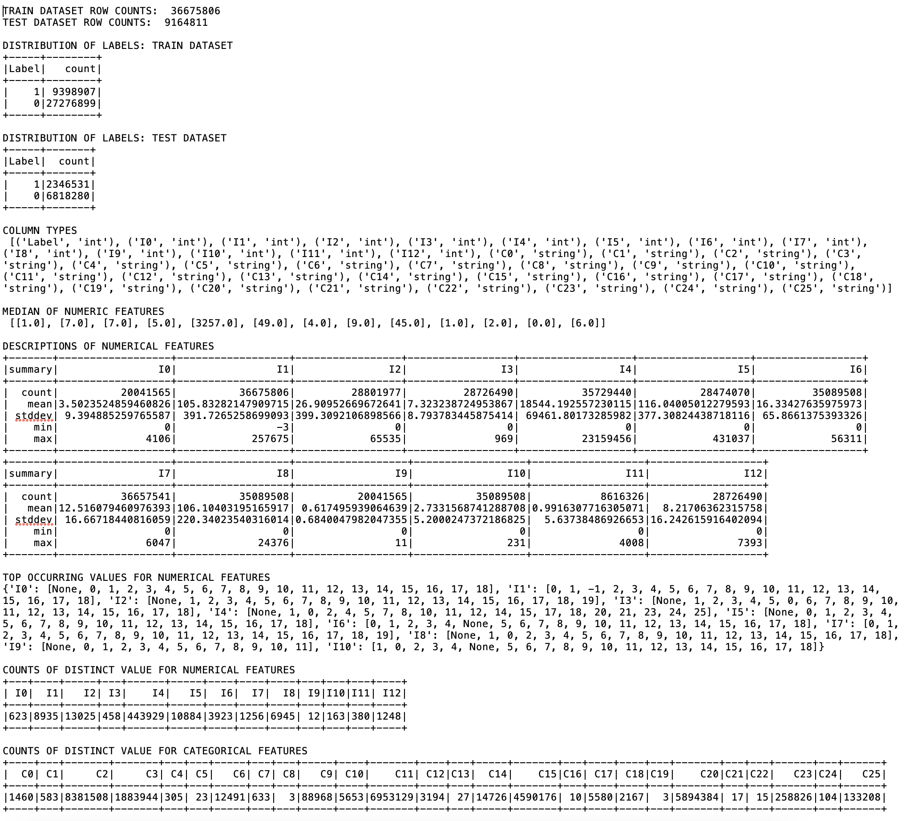
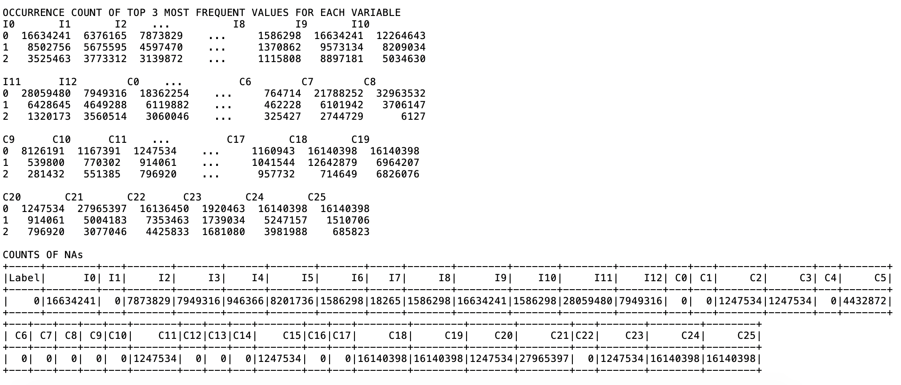
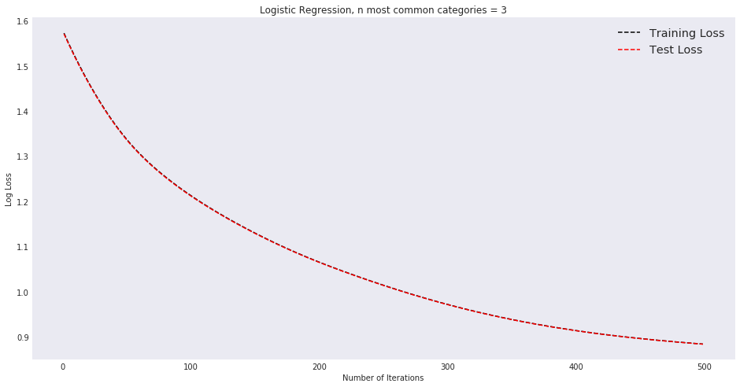

# Parallel Click-Through Rate Predictor

12 December 2018

Noah Randolph;
Wei Wang;
Alice Lam;
John Tabbone


#### Toy Dataset Illustration

```python
%%writefile toyDataset.py
#!/usr/bin/env python

import numpy as np
import csv

# Set the seed for random numbers
SEED = 2615

# Number of numeric columns
NUMERIC_COLS = 2
# Number of categorical columns (one hot encoded)
ONE_HOT_COLS = 2


# start Spark Session
from pyspark.sql import SparkSession
app_name = "loadAndEDA"
spark = SparkSession\
        .builder\
        .appName(app_name)\
        .getOrCreate()
sc = spark.sparkContext


# Creates a toy dataset in the form
# LABEL,INT,INT,CAT,CAT
# where CAT is categorical data that is represented as one hot encoded
# (i.e. 0 or 1)
#
# w:  a list of weights 
# nrows:  The number of rows to produce
def generateToyDataset(w=[8, -3, -1, 3, 8],nrows = 8):
    '''generate toy logistic regression dataset with numerical and 1-hot encoded features'''
        
    # set random number generator
    np.random.seed(SEED)
    
    # These two x vectors represent numeric data
    x1 = np.random.randint(0, 10, nrows)
    x2 = np.random.randint(0, 10, nrows)
    
    # These two represent categorical data that has been
    # one hot encoded
    x3 = np.random.randint(0, 2, nrows) 
    x4 = np.ones(nrows, np.int8) - x3 
    
    # Create an error term for linear function
    noise = np.random.normal(5, 1, nrows)
    
    # Create linear function to determine labels
    v = (w[0] + x1*w[1] + x2*w[2] + x3*w[3] + x4*w[4] + noise)
    
    # Activation function v>0 to determine binary labels 1 and -1
    y = (v>0) * 2 - 1 
    
    # Assemble vectors into single matrix structure
    # NB:  This technique works to assemble the toy dataset but would 
    # be cost prohibitive to perform on a larger dataset
    df = spark.createDataFrame(zip(y.tolist(), x1.tolist(), x2.tolist(), x3.tolist(), x4.tolist()))
 
    # Rename columns from default
    # c1,c2,c3 to human readable
    # Label,I1,I2,C1,C2
    oldColNames = df.columns
    newColNames = ['Label']+['I{}'.format(i) for i in range(0,NUMERIC_COLS)]+['C{}'.format(i) for i in range(0,ONE_HOT_COLS)]
    for oldName, newName in zip(oldColNames, newColNames):
        df = df.withColumnRenamed(oldName, newName)
    return df

# Utility function to change format of RDD
def dfToRDD(row):
    '''
    Converts dataframe row to rdd format.
        From: DataFrame['Label', 'I0', ..., 'C0', ...]
        To:   (features_array, y)
    '''    
    # Create matrix structure of numeric and catageory features
    features_list = [row['I{}'.format(i)] for i in range(0, NUMERIC_COLS)] + [row['C{}'.format(i)] for i in range(0, ONE_HOT_COLS)]
    features_array = np.array(features_list)
    # extract labels
    y = row['Label']
    
    #return features_array (matrix) paired with label vector
    return (features_array, y)


# Given dataRDD, will return an rdd with standardized column values.
#  This will transform each feature into a set of values whose mean
# converges on 0 and who's standard deviation converges on 1
def normalize(dataRDD):
    # Take the mean of each column
    featureMeans = dataRDD.map(lambda x: x[0]).mean()
    # Take standard deviation of each column
    featureStdev = np.sqrt(dataRDD.map(lambda x: x[0]).variance())
    # Standardize the features by calculating the difference between 
    # the actual and the mean divided by the standard deviation.  
    normedRDD = dataRDD.map(lambda x: ((x[0] - featureMeans)/featureStdev, x[1]))
    return normedRDD


def GDUpdate(dataRDD, W, learningRate = 0.1):
    """
    Args:
        dataRDD - records are tuples of (features_array, y)
        W       - (array) model coefficients with bias at index 0
    Returns:
        new_model - (array) updated coefficients, bias at index 0
    """
    # add a bias 'feature' of 1 at index 0
    augmentedData = dataRDD.map(lambda x: (np.append([1.0], x[0]), x[1])).cache()
    
    grad = augmentedData.map(lambda p: (-p[1] * (1 - (1 / (1 + np.exp(-p[1] * np.dot(W, p[0]))))) * p[0])) \
                        .reduce(lambda a, b: a + b)
    new_model = W - learningRate * grad
    return new_model


def logLoss(dataRDD, W):
    """
    Args:
        dataRDD - each record is a tuple of (features_array, y)
        W       - (array) model coefficients with bias at index 0
    """
    augmentedData = dataRDD.map(lambda x: (np.append([1.0], x[0]), x[1]))
    loss = augmentedData.map(lambda p: (np.log(1 + np.exp(-p[1] * np.dot(W, p[0]))))) \
                        .reduce(lambda a, b: a + b)
    return loss


# create a toy dataset that includes 1-hot columns for development
df = generateToyDataset()   

# Create training data set by converting dataframe to RDD.  
# Seperates label column from feature matrix and returns at tupple
# e.g. (features,labels)
trainRDD = df.rdd.map(dfToRDD)

# normalize RDD and cache
normedRDDcached = normalize(trainRDD).cache()
print(normedRDDcached.take(1))

# create initial weights to train
featureLen = len(normedRDDcached.take(1)[0][0])

wInitial = np.random.normal(size=featureLen+1) # add 1 for bias

# 1 iteration of gradient descent with initial
# random values
w = GDUpdate(normedRDDcached, wInitial)

# Iterate
nSteps = 5
for idx in range(nSteps):
    print("----------")
    print(f"STEP: {idx+1}")
    w = GDUpdate(normedRDDcached, w)
    loss = logLoss(normedRDDcached, w)
    print(f"Loss: {loss}")
    print(f"Model: {[round(i,3) for i in w]}")
```

    Overwriting toyDataset.py


```python
!python toyDataset.py
```

    2018-12-10 08:21:13 WARN  NativeCodeLoader:62 - Unable to load native-hadoop library for your platform... using builtin-java classes where applicable
    Setting default log level to "WARN".
    To adjust logging level use sc.setLogLevel(newLevel). For SparkR, use setLogLevel(newLevel).
    [(array([-1.63525964,  0.62123652,  1.        , -1.        ]), 1)]
    ----------
    STEP: 1
    Loss: 7.7014879401802405
    Model: [1.101, -0.162, -1.391, -0.468, -0.797]
    ----------
    STEP: 2
    Loss: 6.1460241873746195
    Model: [0.865, -0.478, -1.282, -0.469, -0.795]
    ----------
    STEP: 3
    Loss: 5.006600355698076
    Model: [0.66, -0.743, -1.182, -0.491, -0.774]
    ----------
    STEP: 4
    Loss: 4.183106733189442
    Model: [0.485, -0.964, -1.092, -0.52, -0.744]
    ----------
    STEP: 5
    Loss: 3.591671886745936
    Model: [0.337, -1.15, -1.016, -0.55, -0.714]


### **EDA**

#### Write LoadAndEDA python file


```python
%%writefile loadAndEDA.py
#!/usr/bin/env python
import subprocess

subprocess.call(["pip","install","seaborn"])

from pyspark.sql import types
from pyspark.sql.functions import udf, col, countDistinct, isnan, when, count, desc
import pandas as pd
from pyspark.mllib.stat import Statistics
import numpy as np
import seaborn as sns
import matplotlib.pyplot as plt

MAINCLOUDPATH = 'gs://w261_final_project/train.txt'
MINICLOUDPATH = 'gs://w261_final_project/train_005.txt'
MINILOCALPATH = 'data/train_005.txt'

SEED = 2615


# start Spark Session
from pyspark.sql import SparkSession
app_name = "loadAndEDA"
spark = SparkSession\
        .builder\
        .appName(app_name)\
        .getOrCreate()
sc = spark.sparkContext


def loadData():
    '''load the data into a Spark dataframe'''
    # select path to data: MAINCLOUDPATH; MINICLOUDPATH; MINILOCALPATH
    df = spark.read.csv(path=MAINCLOUDPATH, sep='\t')
    # change column names
    oldColNames = df.columns
    newColNames = ['Label']+['I{}'.format(i) for i in range(0,13)]+['C{}'.format(i) for i in range(0,26)]
    for oldName, newName in zip(oldColNames, newColNames):
        df = df.withColumnRenamed(oldName, newName)
    # change int column types to int from string
    for col in df.columns[:14]:
        df = df.withColumn(col, df[col].cast('int'))
    return df


def splitIntoTestAndTrain(df):
    '''randomly splits 80/20 into training and testing dataframes'''
    splits = df.randomSplit([0.2, 0.8], seed=SEED)
    testDf = splits[0]
    trainDf = splits[1]
    return testDf, trainDf

def getMedians(df, cols):
    '''returns approximate median values of the columns given, with null values ignored'''
    # 0.5 relative quantile probability and 0.05 relative precision error
    return df.approxQuantile(cols, [0.5], 0.05)

def getDescribe(df, cols):
    return df.select(cols).describe().show()

def getDistinctCount(df, cols):
    return df.agg(*(countDistinct(col(c)).alias(c) for c in cols)).show()

def checkNA(df, cols):
    return df.select([count(when(isnan(c) | col(c).isNull(), c)).alias(c) for c in cols]).show()

def getTopCountsValues(df, n, cols):
    topCounts_dict= {key: value for (key, value) in zip(cols, 
                                        [[x[1] for x in df.groupBy(c).count().sort(desc("count")).head(n)] \
                                         for c in cols])}
    return topCounts_dict

def getTopCountsCategories(df, n, cols):
    topCounts_dict= {key: value for (key, value) in zip(cols, 
                                        [[x[0] for x in df.groupBy(c).count().sort(desc("count")).head(n)] \
                                         for c in cols])}
    return topCounts_dict


df = loadData().cache()
testDf, trainDf = splitIntoTestAndTrain(df)

print("\nTRAIN DATASET ROW COUNTS: ", trainDf.count())
print("\nTEST DATASET ROW COUNTS: ", testDf.count())

print("\nDISTRIBUTION OF LABELS: TRAIN DATASET")
trainDf.groupBy("Label").count().show()
print("\nDISTRIBUTION OF LABELS: TEST DATASET")
testDf.groupBy("Label").count().show()

print("\nCOLUMN TYPES\n", df.dtypes)
print("\nMEDIAN OF NUMERIC FEATURES\n", getMedians(trainDf, trainDf.columns[1:14]))

print("\nDESCRIPTIONS OF NUMERICAL FEATURES")
getDescribe(trainDf, trainDf.columns[1:8])
getDescribe(trainDf, trainDf.columns[8:14])

print("TOP OCCURRING VALUES FOR NUMERICAL FEATURES")
print (getTopCountsCategories(trainDf, 20, trainDf.columns[1:12]))

print("\nCOUNTS OF DISTINCT VALUE FOR NUMERICAL FEATURES")
getDistinctCount(trainDf, trainDf.columns[1:14])

print("\nCOUNTS OF DISTINCT VALUE FOR CATEGORICAL FEATURES")
getDistinctCount(trainDf, trainDf.columns[14:])

print("\nOCCURENCE COUNT OF TOP 3 MOST FREQUENT VALUES FOR EACH VARIABLE")
count_n = 3 # Max can only be 3 because one column (c8) has only 3 categorical values
print (pd.DataFrame(getTopCountsValues(trainDf, count_n, trainDf.columns[1:12])))
print("\n")
print (pd.DataFrame(getTopCountsValues(trainDf, count_n, trainDf.columns[12:23])))
print("\n")
print (pd.DataFrame(getTopCountsValues(trainDf, count_n, trainDf.columns[23:34])))
print("\n")
print (pd.DataFrame(getTopCountsValues(trainDf, count_n, trainDf.columns[34:])))


print("\nCOUNTS OF NAs")
checkNA(trainDf, trainDf.columns[:20])
checkNA(trainDf, trainDf.columns[20:])
```

#### *Below code is for showing plots within jupyter notebook*


```python
# For running plotting locally in jupyter notebook

from pyspark.sql import types
from pyspark.sql.functions import udf, col, countDistinct, isnan, when, count, desc
import pandas as pd
from pyspark.mllib.stat import Statistics
import numpy as np
import seaborn as sns
import matplotlib.pyplot as plt

MAINCLOUDPATH = 'gs://w261_final_project/train.txt'
MINICLOUDPATH = 'gs://w261_final_project/train_005.txt'
MINILOCALPATH = 'data/train_005.txt'

SEED = 2615


# start Spark Session
from pyspark.sql import SparkSession
app_name = "loadAndEDA"
spark = SparkSession\
        .builder\
        .appName(app_name)\
        .getOrCreate()
sc = spark.sparkContext

def loadData():
    '''load the data into a Spark dataframe'''
    # select path to data: MAINCLOUDPATH; MINICLOUDPATH; MINILOCALPATH
    df = spark.read.csv(path=MINILOCALPATH, sep='\t')
    # change column names
    oldColNames = df.columns
    newColNames = ['Label']+['I{}'.format(i) for i in range(0,13)]+['C{}'.format(i) for i in range(0,26)]
    for oldName, newName in zip(oldColNames, newColNames):
        df = df.withColumnRenamed(oldName, newName)
    # change int column types to int from string
    for col in df.columns[:14]:
        df = df.withColumn(col, df[col].cast('int'))
    return df

def splitIntoTestAndTrain(df):
    '''randomly splits 80/20 into training and testing dataframes'''
    splits = df.randomSplit([0.2, 0.8], seed=SEED)
    testDf = splits[0]
    trainDf = splits[1]
    return testDf, trainDf

def plotHist(df):
    '''plot histogram of numeric features'''
    df.hist(figsize=(15,15), bins=30)
    return plt.show()

def CorrMatrix(df):
    '''get correlation matrix of numeric features'''
    corr = df.corr()
    fig, ax = plt.subplots(figsize=(11, 9))
    mask = np.zeros_like(corr, dtype=np.bool)
    mask[np.triu_indices_from(mask)] = True
    cmap = sns.diverging_palette(240, 10, as_cmap=True)
    sns.heatmap(corr, mask=mask, cmap=cmap, center=0, linewidths=.5)
    plt.title("Correlations between numerical features.")
    return plt.show()

df = loadData().cache()
testDf, trainDf = splitIntoTestAndTrain(df)

```

##### Run EDA on a sample dataset


```python
!python loadAndEDA.py
```

    Requirement already satisfied: seaborn in /opt/anaconda/lib/python3.6/site-packages (0.9.0)
    Requirement already satisfied: pandas>=0.15.2 in /opt/anaconda/lib/python3.6/site-packages (from seaborn) (0.23.3)
    Requirement already satisfied: numpy>=1.9.3 in /opt/anaconda/lib/python3.6/site-packages (from seaborn) (1.15.0)
    Requirement already satisfied: matplotlib>=1.4.3 in /opt/anaconda/lib/python3.6/site-packages (from seaborn) (2.2.2)
    Requirement already satisfied: scipy>=0.14.0 in /opt/anaconda/lib/python3.6/site-packages (from seaborn) (1.1.0)
    Requirement already satisfied: python-dateutil>=2.5.0 in /opt/anaconda/lib/python3.6/site-packages (from pandas>=0.15.2->seaborn) (2.7.3)
    Requirement already satisfied: pytz>=2011k in /opt/anaconda/lib/python3.6/site-packages (from pandas>=0.15.2->seaborn) (2018.5)
    Requirement already satisfied: cycler>=0.10 in /opt/anaconda/lib/python3.6/site-packages (from matplotlib>=1.4.3->seaborn) (0.10.0)
    Requirement already satisfied: pyparsing!=2.0.4,!=2.1.2,!=2.1.6,>=2.0.1 in /opt/anaconda/lib/python3.6/site-packages (from matplotlib>=1.4.3->seaborn) (2.2.0)
    Requirement already satisfied: six>=1.10 in /opt/anaconda/lib/python3.6/site-packages (from matplotlib>=1.4.3->seaborn) (1.11.0)
    Requirement already satisfied: kiwisolver>=1.0.1 in /opt/anaconda/lib/python3.6/site-packages (from matplotlib>=1.4.3->seaborn) (1.0.1)
    Requirement already satisfied: setuptools in /opt/anaconda/lib/python3.6/site-packages (from kiwisolver>=1.0.1->matplotlib>=1.4.3->seaborn) (39.2.0)
    distributed 1.22.0 requires msgpack, which is not installed.
    You are using pip version 10.0.1, however version 18.1 is available.
    You should consider upgrading via the 'pip install --upgrade pip' command.
    2018-12-12 03:26:54 WARN  NativeCodeLoader:62 - Unable to load native-hadoop library for your platform... using builtin-java classes where applicable
    Setting default log level to "WARN".
    To adjust logging level use sc.setLogLevel(newLevel). For SparkR, use setLogLevel(newLevel).
    2018-12-12 03:26:55 WARN  Utils:66 - Service 'SparkUI' could not bind on port 4040. Attempting port 4041.
    2018-12-12 03:27:00 WARN  Utils:66 - Truncated the string representation of a plan since it was too large. This behavior can be adjusted by setting 'spark.debug.maxToStringFields' in SparkEnv.conf.
                                                                                    
    TRAIN DATASET ROW COUNTS:  18379
    
    TEST DATASET ROW COUNTS:  4578
    
    DISTRIBUTION OF LABELS: TRAIN DATASET
    +-----+-----+
    |Label|count|
    +-----+-----+
    |    1| 4777|
    |    0|13602|
    +-----+-----+
    
    
    DISTRIBUTION OF LABELS: TEST DATASET
    +-----+-----+
    |Label|count|
    +-----+-----+
    |    1| 1123|
    |    0| 3455|
    +-----+-----+
    
    
    COLUMN TYPES
     [('Label', 'int'), ('I0', 'int'), ('I1', 'int'), ('I2', 'int'), ('I3', 'int'), ('I4', 'int'), ('I5', 'int'), ('I6', 'int'), ('I7', 'int'), ('I8', 'int'), ('I9', 'int'), ('I10', 'int'), ('I11', 'int'), ('I12', 'int'), ('C0', 'string'), ('C1', 'string'), ('C2', 'string'), ('C3', 'string'), ('C4', 'string'), ('C5', 'string'), ('C6', 'string'), ('C7', 'string'), ('C8', 'string'), ('C9', 'string'), ('C10', 'string'), ('C11', 'string'), ('C12', 'string'), ('C13', 'string'), ('C14', 'string'), ('C15', 'string'), ('C16', 'string'), ('C17', 'string'), ('C18', 'string'), ('C19', 'string'), ('C20', 'string'), ('C21', 'string'), ('C22', 'string'), ('C23', 'string'), ('C24', 'string'), ('C25', 'string')]
    
    MEDIAN OF NUMERIC FEATURES
     [[1.0], [2.0], [6.0], [4.0], [2715.0], [31.0], [3.0], [7.0], [36.0], [1.0], [1.0], [0.0], [4.0]]
    
    DESCRIPTIONS OF NUMERICAL FEATURES
    +-------+------------------+------------------+------------------+-----------------+-----------------+------------------+-----------------+
    |summary|                I0|                I1|                I2|               I3|               I4|                I5|               I6|
    +-------+------------------+------------------+------------------+-----------------+-----------------+------------------+-----------------+
    |  count|             10109|             18379|             14386|            14314|            17905|             14191|            17600|
    |   mean|3.5502027895934316|101.80967408455302| 25.63763381064924| 7.30068464440408|18436.65942474169|111.70875907265167|17.12034090909091|
    | stddev| 9.293289659497264|374.02991892400274|331.46919953261744|8.624079890068804|68931.50353591116|332.34996893862655|66.91093732423182|
    |    min|                 0|                -2|                 0|                0|                0|                 0|                0|
    |    max|               292|              6901|             31814|              186|          1585026|             21658|             2802|
    +-------+------------------+------------------+------------------+-----------------+-----------------+------------------+-----------------+
    
    +-------+------------------+------------------+------------------+-----------------+------------------+------------------+
    |summary|                I7|                I8|                I9|              I10|               I11|               I12|
    +-------+------------------+------------------+------------------+-----------------+------------------+------------------+
    |  count|             18369|             17600|             10109|            17600|              4282|             14314|
    |   mean|12.419293374707387|106.89028409090909|0.6220199821940845|2.790738636363636|0.8895375992526856| 8.168366634064553|
    | stddev|14.088934412061754|227.30410625706682|0.6948805353765156|5.310155836571858|3.8061148775636693|11.428526114043635|
    |    min|                 0|                 0|                 0|                0|                 0|                 0|
    |    max|               626|              7501|                 7|               91|                86|               226|
    +-------+------------------+------------------+------------------+-----------------+------------------+------------------+
    
    TOP OCCURRING VALUES FOR NUMERICAL FEATURES
    {'I0': [None, 0, 1, 2, 3, 4, 5, 6, 7, 9, 8, 10, 11, 12, 13, 15, 14, 16, 18, 19], 'I1': [0, 1, -1, 2, 3, 4, 5, 6, 7, 9, 8, 10, 12, 11, 13, 16, 17, 15, 14, 18], 'I2': [None, 1, 2, 3, 4, 5, 6, 7, 8, 9, 10, 11, 13, 12, 14, 15, 17, 16, 19, 18], 'I3': [None, 1, 2, 3, 4, 5, 0, 6, 7, 8, 9, 10, 11, 12, 13, 14, 15, 16, 17, 18], 'I4': [None, 1, 0, 2, 4, 5, 8, 7, 10, 14, 12, 11, 15, 17, 18, 21, 28, 23, 24, 25], 'I5': [None, 0, 1, 2, 3, 5, 4, 6, 7, 8, 9, 10, 11, 12, 18, 14, 13, 15, 17, 21], 'I6': [0, 1, 2, 3, 4, None, 5, 6, 7, 8, 9, 10, 11, 12, 13, 14, 15, 16, 18, 19], 'I7': [0, 1, 2, 3, 4, 5, 6, 7, 8, 9, 11, 10, 12, 14, 13, 16, 17, 15, 18, 19], 'I8': [None, 1, 0, 2, 3, 4, 5, 6, 7, 8, 9, 13, 11, 10, 14, 12, 15, 18, 16, 17], 'I9': [None, 0, 1, 2, 3, 4, 5, 6, 7], 'I10': [1, 0, 2, 3, 4, None, 5, 6, 7, 8, 9, 10, 11, 12, 13, 14, 15, 16, 18, 17]}
    
    COUNTS OF DISTINCT VALUE FOR NUMERICAL FEATURES
    +---+----+---+---+----+---+---+---+---+---+---+---+---+
    | I0|  I1| I2| I3|  I4| I5| I6| I7| I8| I9|I10|I11|I12|
    +---+----+---+---+----+---+---+---+---+---+---+---+---+
    | 92|1189|325| 69|8400|942|365| 61|972|  8| 68| 43|106|
    +---+----+---+---+----+---+---+---+---+---+---+---+---+
    
    
    COUNTS OF DISTINCT VALUE FOR CATEGORICAL FEATURES
    +---+---+-----+----+---+---+----+---+---+----+----+----+----+---+----+----+---+----+---+---+----+---+---+----+---+----+
    | C0| C1|   C2|  C3| C4| C5|  C6| C7| C8|  C9| C10| C11| C12|C13| C14| C15|C16| C17|C18|C19| C20|C21|C22| C23|C24| C25|
    +---+---+-----+----+---+---+----+---+---+----+----+----+----+---+----+----+---+----+---+---+----+---+---+----+---+----+
    |236|435|10328|7028| 78|  9|4533|131|  3|4812|2676|9670|2172| 25|2850|8588|  9|1564|697|  3|9201|  9| 14|4099| 44|3140|
    +---+---+-----+----+---+---+----+---+---+----+----+----+----+---+----+----+---+----+---+---+----+---+---+----+---+----+
    
    
    OCCURENCE COUNT OF TOP 3 MOST FREQUENT VALUES FOR EACH VARIABLE
         I0    I1    I2    I3   I4    I5    I6    I7   I8    I9   I10
    0  8270  3175  3993  4065  474  4188  4016  2165  779  8270  6062
    1  4288  2832  2342  2298  430   965  2363  1412  657  4824  4165
    2  1805  1926  1564  1885  337   493  1578  1340  587  4478  2571
    
    
         I11   I12    C0    C1   C2   C3     C4    C5   C6     C7     C8
    0  14097  4065  9262  2175  653  653  12304  7250  403  10909  16559
    1   3216  2267  3033   756  424  621   2934  4029  236   3071   1815
    2    618  1804  1575   712  205  430   1179  3391  167   1401      5
    
    
         C9  C10  C11  C12   C13  C14  C15   C16  C17   C18   C19
    0  4134  609  653  609  6392  292  653  8386  598  8082  8082
    1   270  390  430  447  6373  188  430  2448  532  6355  3496
    2   129  274  424  291  2806  173  424  2103  495   352  3478
    
    
       C20    C21   C22  C23   C24   C25
    0  653  13890  8102  923  8082  8082
    1  430   2596  3607  858  2554   744
    2  424   1557  2248  813  2038   334
    
    COUNTS OF NAs
    +-----+----+---+----+----+---+----+---+---+---+----+---+-----+----+---+---+---+---+---+----+
    |Label|  I0| I1|  I2|  I3| I4|  I5| I6| I7| I8|  I9|I10|  I11| I12| C0| C1| C2| C3| C4|  C5|
    +-----+----+---+----+----+---+----+---+---+---+----+---+-----+----+---+---+---+---+---+----+
    |    0|8270|  0|3993|4065|474|4188|779| 10|779|8270|779|14097|4065|  0|  0|653|653|  0|2260|
    +-----+----+---+----+----+---+----+---+---+---+----+---+-----+----+---+---+---+---+---+----+
    
    +---+---+---+---+---+---+---+---+---+---+---+---+----+----+---+-----+---+---+----+----+
    | C6| C7| C8| C9|C10|C11|C12|C13|C14|C15|C16|C17| C18| C19|C20|  C21|C22|C23| C24| C25|
    +---+---+---+---+---+---+---+---+---+---+---+---+----+----+---+-----+---+---+----+----+
    |  0|  0|  0|  0|  0|653|  0|  0|  0|653|  0|  0|8082|8082|653|13890|  0|653|8082|8082|
    +---+---+---+---+---+---+---+---+---+---+---+---+----+----+---+-----+---+---+----+----+
    
    
    Histograms for Numeric Values
    Figure(1500x1500)
    
    Correlation Matrix between Numeric Values
    Figure(1100x900)


```python
pandaTrain =trainDf.toPandas()
print("\nHistograms for Numeric Values")
plotHist(pandaTrain)
```

    
    Histograms for Numeric Values





```python
trainDf.dropna().select('Label').describe().show()
```

    +-------+------------------+
    |summary|             Label|
    +-------+------------------+
    |  count|               330|
    |   mean|0.3424242424242424|
    | stddev|0.4752412940353723|
    |    min|                 0|
    |    max|                 1|
    +-------+------------------+
    


### Results from EDA on a Sample of Data:

__1. Size of sample__
>22957 rows with 80/20 train, test split. ~18000 in train, ~4600 in test.

__2. Label distribution__
> We have an imbalanced dataset with Label 1 occurring in about 25% of the examples. Thus a simple accuracy score is likely insufficient. In an extreme example where the model did not learn anything and just predict every class as 0, the model would have a very decent accuracy score of 75%. Given imbalance dataset, we would need to evaluate precision and recall as well.

__3. Number of features__
> There are 13 features with numerical values, and 26 features with categorical values.

__4. Numerical features__
> We were told explicitly by the data provider that the first 13 features are numerical values. The median of the features ranges from 1 to 2715, and the mean ranges from 0.72 to 18437. Looking at the description of these features, we notice that the range between minimum and maximum varies greatly, from min - max of 0 - 7 to min-max of 0 - 1585026. Standard deviation ranges from 0.69 to 69831. The histogram above shows that we do not have normal distribution and the distribution is very positively skewed. Since we are using logistic regression, __we need to rescale the numerical variables so that they will have comparable range.__

> Looking at the "TOP OCCURRING CATEGORIES FOR NUMERICAL FEATURES", we notice that the values are all integers. It is possible that these numbers are not continuous variables. They might be ordinal variables. If they were ordinal variables, we do not have information on the ordering of the values nor know whether the numerical values have equidistance (e.g. distance from 1 to 2 is the same as distance from 2 to 3). If we were to treat them as ordinal variables, we would have to use one-hot encoding to create features. Given some of the numerical features have so many unique values (I1, I5 has about 1000, I4 has 8400) it'd be a nightmare for dimensionality. For simplicity sake and also retaining all the values from each feature, we assume they are numerical 
values for now. 

> __Challenges in making it scalable:__
> Normalizing by standard deviation requires calculating mean and standard deviation across node. To make it scalable, we need to map all the sums and counts, and derive mean in the reducer. Once we have the mean value, we need to broadcast it too all the nodes, and map the calculation of deviation from mean and the counts, and derive standard deviation in the reducer. After that, we need to broadcast the mean and standard deviation to all the node to transform each value with standard deviation normalization.

__5. Categorical features__
> For the 26 categorical features, 13 features have more than 1000 unique values, of which 5 features have over 5000 unique values. If we were to one-hot encode every unique values, we would have about 30 million features. 

> Looking at "OCCURENCE COUNT OF TOP 3 MOST FREQUENT VALUES FOR EACH VARIABLE", we see that a few feature have a relatively even distribution across all unique values, while some are highly concentrated in the top few values. For example, for C7, top value has ~11000 count, second most frequent value has 3000 count, third most frequent value has 1400 count. For C8, the respective counts are ~17000, ~1800, 5. It makes sense that some of these variables have long tails. For example, a variable such as which browser the person is using, one would encounter "internet explorer" and "google chrome" as top two categories with probably about 80% of the occurrence, with some long tail for browsers such as Opera, Firefox, etc. Processing 30 million features is computationally expensive and time consuming. We hypothesize that we may not learn so much from the long tail values (such as using Opera vs Firefox) and that we can consider them as one category such as "others". For each categorical feature we only consider top 3 most frequent values and relabel everything else as 'rare'.

> __Challenges in making it scalable:__
> 1. We need to aggregate counts across all nodes to know which are the top 3 values. We need to map all the key and value (counts), and aggregate the counts for each key (unique value) in the reducer. We then sort the key value pair by values, take the top 3 values, and broadcast the list of top 3 values to all nodes. In each node, we compare the values against the top 3 value list. We emit the origin value if its in the top 3 list, or emit 'rare' if it's not in the top 3 list. <br>
> 2. We need to create one-hot encoding columns for each node. While we can independently run one-hot encoding per node, it is potentially problematic if some nodes do not contain all possible values in some columns. For example, one node may only have value 'a123', 'b123', 'c123' as values for column 15, while another node may only have value 'c123', 'd123', 'rare' in column 15. An independent one-hot encoding would create only columns c15_a123, c15_b123, c15_c123 for first node, and only columns c15_c123, c15_d123, c15_rare for the second node. We would have mismatched columns across nodes.<br>
> To address this problem, we need to gather a list of all column values and broadcast it to each node. (The column values are collected in step 1 above). Each node would generate columns using that list of values from step 1. All column values would be set to 0. We can map a function to change the value to 1 if the row has value matches with the column name.

__6. NAs__
> 15 out of 39 features do not have null values. Among the remaining 24, 13 of them have over 3000 null values. 
> As shown in the above cell, if we were to drop any row with NAs, there would be 330 rows left out of ~18000 in training set. i.e. ~98% of rows have some null values in at least one feature. This sounds reasonable for a dataset about internet browsing behavior. We cannot simply drop rows with NAs.
> Without any domain understanding of what those features are, we can only use a very simplistic way to impute some values to fill NAs. For numerical values, we fill NAs with median. For categorical values, we fill NAs with the most frequent values.

> __Challenges in making it scalable:__
> Similar to the above. We need to map key values (counts) and aggregate the counts in reducer to get median. For most frequent values, the step is explained above in 5.2..

__7. Correlation Matrix__
> The below correlation matrix shows that most numerical values do not have high correlation with each other. Thus we are not eliminating any features.


```python
print("\nCorrelation Matrix between Numeric Values")
CorrMatrix(pandaTrain)
```

    
    Correlation Matrix between Numeric Values





#### Running EDA on the full dataset shows similarity of data pattern as observed in the sample above. 

- The full dataset still shows imbalanced dataset with 34% with label 1, 66% with label 0.

`!python submit_job_to_cluster.py --project_id=w261-222623 --zone=us-central1-b --cluster_name=edacluster --gcs_bucket=w261_final_project --key_file=$HOME/w261.json --create_new_cluster --pyspark_file=loadAndEDA.py --instance_type=n1-standard-16 --worker_nodes=6`


```python
from IPython.display import Image
Image(filename='full_dataset_EDA_1.png') 
```





```python
Image(filename='full_dataset_EDA_2.png') 
```





### Algorithm Implementation


```python
%%writefile algorithmImplementation.py
#!/usr/bin/env python

from pyspark.sql.types import StringType
from pyspark.sql.functions import udf, desc, isnan, when
import numpy as np
from operator import add
import copy
import time


MAINCLOUDPATH = 'gs://w261_final_project/train.txt'
MINICLOUDPATH = 'gs://w261_final_project/train_005.txt'
MINILOCALPATH = 'data/train_005.txt'
NUMERICCOLS = 13
CATEGORICALCOLS = 26
NUMERICCOLNAMES = ['I{}'.format(i) for i in range(0,NUMERICCOLS)]
CATCOLNAMES = ['C{}'.format(i) for i in range(0,CATEGORICALCOLS)]
SEED = 2615


# start Spark Session
from pyspark.sql import SparkSession
app_name = "algorithmImplementation"
spark = SparkSession\
        .builder\
        .appName(app_name)\
        .getOrCreate()
sc = spark.sparkContext


def loadData():
    '''load the data into a Spark dataframe'''
    # select path to data: MAINCLOUDPATH; TOYCLOUDPATH; TOYLOCALPATH
    df = spark.read.csv(path=MAINCLOUDPATH, sep='\t')
    # change column names
    oldColNames = df.columns
    newColNames = ['Label'] + NUMERICCOLNAMES + CATCOLNAMES
    for oldName, newName in zip(oldColNames, newColNames):
        df = df.withColumnRenamed(oldName, newName)
    # change int column types to int from string
    for col in df.columns[:14]:
        df = df.withColumn(col, df[col].cast('int'))
    return df


def splitIntoTestAndTrain(df):
    '''randomly splits 80/20 into training and testing dataframes'''
    splits = df.randomSplit([0.2, 0.8], seed=SEED)
    testDf = splits[0]
    trainDf = splits[1]
    return testDf, trainDf


def getMedians(df, cols):
    '''
    returns approximate median values of the columns given, with null values ignored
    '''
    # 0.5 relative quantile probability and 0.05 relative precision error
    return df.approxQuantile(cols, [0.5], 0.05)


def getMostFrequentCats(df, cols, n):
    '''
    returns a dict where the key is the column and value is an ordered list
    of the top n categories in that column in descending order
    '''
    freqCatDict = {col: None for col in df.columns[cols:]}
    for col in df.columns[cols:]:
        listOfRows = df.groupBy(col).count().sort('count', ascending=False).take(n)
        topCats = [row[col] for row in listOfRows]
        freqCatDict[col] = topCats[:n]
    return freqCatDict
    

def rareReplacer(df, dictOfMostFreqSets):
    '''
    Iterates through columns and replaces non-Frequent categories with 'rare' string.
    '''
    for colName in df.columns[NUMERICCOLS+1:]:
        bagOfCats = dictOfMostFreqSets[colName]
        df = df.withColumn(colName, 
                           udf(lambda x: 'rare' if x not in bagOfCats else x, 
                               StringType())(df[colName])).cache()
    return df

    
def dfToRDD(row):
    '''
    Converts dataframe row to rdd format.
        From: DataFrame['Label', 'I0', ..., 'C0', ...]
        To:   (features_array, y)
    '''    
    features_list = [row['I{}'.format(i)] for i in range(0, NUMERICCOLS)] + \
                        [row['C{}'.format(i)] for i in range(0, CATEGORICALCOLS)]
    features_array = np.array(features_list)
    y = row['Label']
    return (features_array, y)


def emitColumnAndCat(line):
    """
    Takes in a row from RDD and emits a record for each categorical column value 
    along with a zero for one-hot encoding. The emitted values will become a 
    reference dictionary for one-hot encoding in later steps.
        Input: (array([features], dtype='<U21'), 0) or (features, label)
        Output: ((categorical column, category), 0) or (complex key, value)
    The last zero in the output is for initializing one-hot encoding.
    """
    elements = line[0][NUMERICCOLS:]
    for catColName, element in zip(CATCOLNAMES, elements):
        yield ((catColName, element), 0)


def oneHotEncoder(line):
    """
    Takes in a row from RDD and emits row where categorical columns are replaced
    with 1-hot encoded columns.
        Input: (numerical and categorical features, label)
        Output: (numerical and one-hot encoded categorical features, label)
    """
    oneHotDict = copy.deepcopy(bOneHotReference.value)
    elements = line[0][NUMERICCOLS:]
    for catColName, element in zip(CATCOLNAMES, elements):
        oneHotDict[(catColName, element)] = 1
    numericElements = list(line[0][:NUMERICCOLS])
    features = np.array(numericElements + [value for key, value in oneHotDict.items()],
                        dtype=np.float)
    return (features, line[1])


def getMeanAndVar(trainRDD):
    """
    Returns the mean and variance of the training dataset for use in normalizing
    future records (e.g. the test set) to be run on model.
    """
    featureMeans = trainRDD.map(lambda x: x[0]).mean()
    featureStDevs = np.sqrt(trainRDD.map(lambda x: x[0]).variance())
    return featureMeans, featureStDevs
    

def normalize(dataRDD, featureMeans, featureStDevs):
    """
    Scale and center data around the mean of each feature.
    """
    normedRDD = dataRDD.map(lambda x: ((x[0] - featureMeans)/featureStDevs, x[1]))
    return normedRDD


def dataAugmenter(line):
        """
        Adds a 1 value to the array of feature values for the bias term
        """
        return (np.append([1.0], line[0]), line[1])


def logLoss(dataRDD, W):
    """
    Compute log loss.
    Args:
        dataRDD - each record is a tuple of (features_array, y)
        W       - (array) model coefficients with bias at index 0
    """
    augmentedData = dataRDD.map(dataAugmenter)
    
    # broadcast the weights
    bW = sc.broadcast(W)
    
    def loss(line):
        loss = np.log(1 + np.exp(-line[1] * np.dot(bW.value, line[0])))
        return loss
    
    losses = augmentedData.map(lambda line: (loss(line), 1)) \
                          .reduce(lambda x,y: (x[0] + y[0], x[1] + y[1]))
    cost = losses[0] / losses[1]
    return cost


def GDUpdateWithReg(dataRDD, W, learningRate = 0.1, regType = None, regParam = 0.1):
    """
    Perform one gradient descent step/update with ridge or lasso regularization.
    Args:
        dataRDD - tuple of (features_array, y)
        W       - (array) model coefficients with bias at index 0
        learningRate - (float) defaults to 0.1
        regType - (str) 'ridge' or 'lasso', defaults to None
        regParam - (float) regularization term coefficient
    Returns:
        model   - (array) updated coefficients, bias still at index 0
    """
    # augmented data
    augmentedData = dataRDD.map(dataAugmenter)
    
    # broadcast the weights
    bW = sc.broadcast(W)
    
    # this gets parallelized
    def partialGrad(line):
        return (((1 / (1 + np.exp(-1 * np.dot(bW.value, line[0])))) - line[1]) * line[0])
    
    # reduce to bring it all back together to compute the gradient
    weightedLogProbabilities = augmentedData.map(lambda line: (partialGrad(line), 1)) \
                                            .reduce(lambda x,y: (x[0] + y[0], x[1] + y[1]))
    
    nonRegGrad = weightedLogProbabilities[0]/weightedLogProbabilities[1]
    
    if regType == 'ridge':
        reg = 2*regParam * sum(W[1:])
    elif regType == 'lasso':
        reg = regParam * sum(W[1:]/np.sign(W[1:]))   
    else:
        reg = 0
    grad = nonRegGrad + reg
    
    new_model = W - (grad * learningRate)    
    return new_model


def GradientDescentWithReg(trainRDD, testRDD, wInit, nSteps = 20, learningRate = 0.1,
                         regType = None, regParam = 0.1, verbose = False):
    """
    Perform nSteps iterations of regularized gradient descent and 
    track loss on a test and train set. Return lists of
    test/train loss and the models themselves.
    """
    # initialize lists to track model performance
    trainHistory, testHistory, modelHistory = [], [], []
    
    model = wInit
    for idx in range(nSteps):  
        # update the model
        model = GDUpdateWithReg(trainRDD, model, learningRate, regType, regParam)
        trainingLoss = logLoss(trainRDD, model) 
        testLoss = logLoss(testRDD, model) 
        
        # keep track of test/train loss for plotting
        trainHistory.append(trainingLoss)
        testHistory.append(testLoss)
        modelHistory.append(model)
        
        # console output if desired
        if verbose:
            print("----------")
            print(f"STEP: {idx+1}")
            print(f"training loss: {trainingLoss}")
            print(f"test loss: {testLoss}")
            print(f"Model: {[round(w,3) for w in model]}")
    return trainHistory, testHistory, modelHistory


def predictionChecker(line):
    """
    line - tuple of (features array including bias, y)
    Takes final model from gradient descent iterations and makes a prediction 
    on the row of test dataset values.
    Returns true positive, false negative, false positive, or true negative
    """
    TP, FN, FP, TN = [0, 0, 0, 0]
    predictionProbability = 1/(1 + np.exp(-1 * np.dot(bModel.value, line[0])))
    if predictionProbability >= 0.5:
        prediction = 1
    else:
        prediction = 0
    if prediction == 1 and line[1] == 1:
        TP = 1
    elif prediction == 0 and line[1] == 1:
        FN = 1
    elif prediction == 1 and line[1] == 0:
        FP = 1
    elif prediction == 0 and line[1] == 0:
        TN = 1
    return (TP, FN, FP, TN)


# load data
df = loadData()
testDf, trainDf = splitIntoTestAndTrain(df)

# get top n most frequent categories for each column (in training set only)
n = 3
mostFreqCatDict = getMostFrequentCats(trainDf, NUMERICCOLS+1, n)

# get dict of sets of most frequent categories in each column for fast lookups during 
# filtering (in later code)
setsMostFreqCatDict = {key: set(value) for key, 
                       value in mostFreqCatDict.items()}

# get the top category from each column for imputation of missing values 
# (in training set only)
fillNADictCat = {key: (value[0] if value[0] is not None else value[1]) for key, 
                 value in mostFreqCatDict.items()}

# get dict of median numeric values for imputation of missing values (in training set only)
fillNADictNum = {key: value for (key, 
                                 value) in zip(trainDf.columns[1:NUMERICCOLS+1], 
                                                    [x[0] for x in getMedians(trainDf,
                                                                              trainDf.columns[1:NUMERICCOLS+1])])}

# impute missing values in training and test set
trainDf = trainDf.na.fill(fillNADictNum) \
                 .na.fill(fillNADictCat)
testDf = testDf.na.fill(fillNADictNum) \
               .na.fill(fillNADictCat)

# replace low-frequency categories with 'rare' string in training and test set
trainDf = rareReplacer(trainDf, setsMostFreqCatDict) # df gets cached in function
testDf = rareReplacer(testDf, setsMostFreqCatDict) # df gets cached in function

# convert dataframe to RDD 
trainRDD = trainDf.rdd.map(dfToRDD).cache()
testRDD = testDf.rdd.map(dfToRDD).cache()
        
# create and broadcast reference dictionary to be used in constructing 1 hot encoded RDD
oneHotReference = trainRDD.flatMap(emitColumnAndCat) \
                          .reduceByKeyLocally(add) # note: only the zero values are being added here 
                                                   # (main goal is to output a dictionary)
bOneHotReference = sc.broadcast(oneHotReference)

# replace rows with new rows having categorical columns 1-hot encoded
trainRDD = trainRDD.map(oneHotEncoder).cache()
testRDD = testRDD.map(oneHotEncoder).cache()

# normalize RDD
featureMeans, featureStDevs = getMeanAndVar(trainRDD)
trainRDD = normalize(trainRDD, featureMeans, featureStDevs).cache()
testRDD = normalize(testRDD, featureMeans, featureStDevs).cache() # use the mean and st. dev. from trainRDD

# create initial weights to train
featureLen = len(trainRDD.take(1)[0][0])
wInit = np.random.normal(size=featureLen+1) # add 1 for bias

# run training iterations
start = time.time()
logLossTrain, logLossTest, models = GradientDescentWithReg(trainRDD, testRDD, wInit, nSteps=500, 
                                                           learningRate = 0.1,
                                                           regType="ridge", regParam=0.001)

# get model accuracy, precision, recall, f1 score
bModel = sc.broadcast(models[-1])
predictionResults = testRDD.map(dataAugmenter) \
                           .map(predictionChecker) \
                           .reduce(lambda x,y: (x[0]+y[0], x[1]+y[1], x[2]+y[2], x[3]+y[3]))
TP = predictionResults[0]
FN = predictionResults[1]
FP = predictionResults[2]
TN = predictionResults[3]
accuracy = (TP+TN)/(TP+FN+FP+TN)
precision = TP/(TP+FP)
recall = TP/(TP+FN)
f1Score = 2/((1/recall)+(1/precision))

print("LOG LOSSES OVER TRAINING SET:")
print(logLossTrain)
print("LOG LOSSES OVER TEST SET:")
print(logLossTest)
print("FINAL MODEL:")
print(bModel.value)
print(f"\n... trained {len(models)} iterations in {time.time() - start} seconds")
print("TEST SET ACCURACY:")
print(accuracy)
print("TEST SET PRECISION:")
print(precision)
print("TEST SET RECALL:")
print(recall)
print("TEST SET F1 SCORE:")
print(f1Score)
```

    Overwriting algorithmImplementation.py


#### Illustration of command to run job on Google Cloud Platform cluster

`!python submit_job_to_cluster.py --project_id=w261-222623 --zone=us-central1-b --cluster_name=finalprojectcluster --gcs_bucket=w261_final_project --key_file=$HOME/w261.json --create_new_cluster --pyspark_file=algorithmImplementation.py --instance_type=n1-standard-16 --worker_nodes=6`

#### Results of Google Cloud Platform cluster execution

`... trained 500 iterations in 16138.672616243362 seconds`<br>
`TEST SET ACCURACY:`<br>
`0.7481226873902687`<br>
`TEST SET PRECISION:`<br>
`0.5290065024278094`<br>
`TEST SET RECALL:`<br>
`0.1462423298173223`<br>
`TEST SET F1 SCORE:`<br>
`0.22913965847621373`<br>

The results above show that with the logistic regression model trained on the Criteo dataset, an ad impression event predicted to result in a click will be correct around 53% of the time (precision = 0.529). Of all of the ad impressions that result in real clicks, the model will correctly identify around 14.6% of them (recall = 0.146).

These metrics are low, in part, due to the imbalanced dataset upon which they were trained. More non-click events were present in the training dataset than click events, leading the model to favor predicting non-click events. This is potentially a cost saver for the advertiser, since only the most determined of ad viewers will be identified as ad clickers by the model, thus leading to less ad expenses while obtaining more user purchases, since you're capturing those who are most likely to buy.

Alternatively, with a more balanced dataset, more ad impressions that result in real clicks can be correctly identified.

#### Model Training Losses Displayed
Below is the trend of log losses as the model was trained over the Criteo dataset using the 3 most common categories from each of the categorical columns. The graph shows that 500 iterations was just about enough to reach the (global) minimum of the cost function.


```python
import matplotlib.pyplot as plt

def plotErrorCurves(trainLoss, testLoss, title = None):
    """
    Helper function for plotting.
    Args: trainLoss (list of log loss) , testLoss (list of log loss)
    """
    fig, ax = plt.subplots(1,1,figsize = (16,8))
    x = list(range(len(trainLoss)))[1:]
    ax.plot(x, trainLoss[1:], 'k--', label='Training Loss')
    ax.plot(x, testLoss[1:], 'r--', label='Test Loss')
    ax.legend(loc='upper right', fontsize='x-large')
    plt.xlabel('Number of Iterations')
    plt.ylabel('Log Loss')
    if title:
        plt.title(title)
    plt.show()

trainLoss = [1.5787012113535561, 1.5723073156232616, 1.5659893938297644, 1.5597462810329858, 1.5535768364958433, 1.5474799795616592, 1.5414546705752208, 1.535499907911388, 1.5296147223668979, 1.5237981995375063, 1.5180494413162642, 1.5123675682931528, 1.5067517332673732, 1.5012011049296066, 1.4957149157958212, 1.49029244388353, 1.4849329756775673, 1.4796358237412888, 1.4744003216624533, 1.4692258225846728, 1.4641117673045636, 1.45905767333725, 1.4540630020701744, 1.4491272205405494, 1.4442499190608646, 1.4394306262651875, 1.43466872691463, 1.4299637879628884, 1.425315469444809, 1.4207234833851938, 1.4161875520964533, 1.4117074136368781, 1.4072829021079183, 1.4029139015061465, 1.3986002748502713, 1.394341876144385, 1.3901386230464603, 1.3859905227119256, 1.3818976538330765, 1.377860118603312, 1.3738780141456264, 1.3699514453866068, 1.3660805244377978, 1.3622653486088678, 1.3585059938102055, 1.3548025113606015, 1.35115490683714, 1.3475631138782727, 1.3440269768944433, 1.340546249428199, 1.3371205858621449, 1.333749519619518, 1.330432452684038, 1.3271686580177653, 1.3239572796266927, 1.3207973345770896, 1.3176877225451837, 1.3146272395052252, 1.3116145922126958, 1.3086484165888126, 1.3057272938434823, 1.3028497703730249, 1.3000143831241715, 1.2972196746533997, 1.294464200085042, 1.2917465360248452, 1.2890652910325608, 1.2864191124943154, 1.283806690839084, 1.2812267651697151, 1.278678130166966, 1.2761596416649459, 1.2736702192539169, 1.2712088461011752, 1.268774567603475, 1.266366489896782, 1.263983777473093, 1.2616256491819875, 1.2592913736482314, 1.2569802654052487, 1.2546916817630458, 1.252425019902442, 1.2501797137986816, 1.2479552308848327, 1.2457510687024753, 1.2435667517249296, 1.241401828296584, 1.2392558677335201, 1.2371284578778095, 1.2350192032861096, 1.232927723865538, 1.2308536536237547, 1.2287966393714183, 1.2267563393950935, 1.2247324221518714, 1.2227245650414014, 1.2207324533579302, 1.2187557795258908, 1.2167942426099885, 1.2148475479586007, 1.2129154068341177, 1.2109975360066203, 1.2090936574069566, 1.2072034979537896, 1.2053267895715385, 1.2034632692771443, 1.2016126791682047, 1.1997747662458191, 1.1979492821557725, 1.1961359829972957, 1.1943346292952495, 1.192544986138381, 1.1907668234323174, 1.1889999162046223, 1.187244044901439, 1.1854989956259891, 1.1837645602901157, 1.1820405366785878, 1.1803267284537464, 1.1786229451447223, 1.1769290021620165, 1.1752447208530508, 1.1735699285843442, 1.1719044588199732, 1.1702481511725489, 1.1686008514226653, 1.166962411520865, 1.1653326895911833, 1.1637115499454478, 1.1620988631024611, 1.1604945057987366, 1.1588983609799814, 1.1573103177690158, 1.1557302714090367, 1.1541581231810527, 1.1525937802931336, 1.1510371557396348, 1.1494881681306433, 1.14794674149523, 1.1464128050650035, 1.1448862930459014, 1.1433671443848965, 1.1418553025348637, 1.140350715216993, 1.1388533341775007, 1.137363114935626, 1.1358800165219571, 1.1344040012087357, 1.1329350342357751, 1.1314730835361244, 1.1300181194653323, 1.1285701145375209, 1.1271290431708163, 1.1256948814446217, 1.124267606871271, 1.1228471981850798, 1.1214336351518113, 1.1200268984016488, 1.1186269692883921, 1.1172338297769688, 1.1158474623606986, 1.1144678500089589, 1.113094976145225, 1.111728824654641, 1.1103693799197598, 1.109016626882329, 1.1076705511283325, 1.106331138992782, 1.1049983776798555, 1.1036722553930376, 1.1023527614686885, 1.1010398865054825, 1.0997336224806886, 1.0984339628434847, 1.097140902574266, 1.095854438198642, 1.094574567744561, 1.093301290631509, 1.0920346074820058, 1.090774519847337, 1.0895210298422504, 1.0882741396865423, 1.0870338511554891, 1.0858001649451785, 1.0845730799637057, 1.0833525925632426, 1.082138695732606, 1.0809313782730636, 1.0797306239831088, 1.0785364108791258, 1.0773487104792583, 1.076167487176452, 1.0749926977242439, 1.0738242908549671, 1.0726622070453853, 1.07150637843926, 1.0703567289306168, 1.069213174405464, 1.0680756231344417, 1.0669439763037971, 1.0658181286681705, 1.0646979693055596, 1.0635833824528875, 1.0624742483996052, 1.0613704444168626, 1.0602718457005873, 1.0591783263084218, 1.0580897600725396, 1.0570060214728358, 1.0559269864575862, 1.0548525332014234, 1.0537825427930765, 1.0527168998479086, 1.0516554930424147, 1.0505982155700242, 1.0495449655191993, 1.0484956461761872, 1.0474501662561104, 1.0464084400667233, 1.0453703876099765, 1.0443359346267467, 1.0433050125904995, 1.042277558655484, 1.0412535155651685, 1.0402328315262914, 1.0392154600538057, 1.0382013597915007, 1.037190494312908, 1.0361828319066215, 1.0351783453498329, 1.0341770116735014, 1.0331788119221672, 1.0321837309111834, 1.031191756983613, 1.0302028817689013, 1.0292170999450758, 1.028234409005882, 1.0272548090341476, 1.0262783024823148, 1.025304893961016, 1.024334590036217, 1.0233673990354544, 1.022403330863455, 1.0214423968273554, 1.02048460947155, 1.0195299824222475, 1.0185785302415762, 1.0176302682911547, 1.0166852126048795, 1.0157433797706947, 1.0148047868210694, 1.0138694511318607, 1.0129373903292231, 1.012008622204207, 1.0110831646346803, 1.0101610355142259, 1.0092422526876015, 1.0083268338923905, 1.007414796706527, 1.0065061585012485, 1.005600936399206, 1.004699147237299, 1.0038008075339764, 1.002905933460647, 1.0020145408168795, 1.0011266450091334, 1.000242261032722, 0.9993614034567173, 0.9984840864115951, 0.997610323579331, 0.9967401281857855, 0.9958735129950772, 0.9950104903058409, 0.994151071949123, 0.9932952692877719, 0.992443093217129, 0.9915945541669359, 0.9907496621042212, 0.9899084265371295, 0.9890708565195446, 0.9882369606563363, 0.9874067471092468, 0.9865802236032072, 0.9857573974331006, 0.9849382754707825, 0.9841228641724238, 0.9833111695859841, 0.9825031973588481, 0.9816989527455172, 0.980898440615366, 0.9801016654603423, 0.9793086314026758, 0.9785193422024694, 0.9777338012652156, 0.9769520116491638, 0.9761739760725447, 0.9753996969206512, 0.9746291762527116, 0.9738624158085867, 0.9730994170152472, 0.9723401809930851, 0.9715847085619644, 0.9708330002470975, 0.97008505628466, 0.969340876627225, 0.9686004609489685, 0.9678638086506328, 0.9671309188643312, 0.9664017904580753, 0.9656764220401631, 0.9649548119633116, 0.9642369583286242, 0.9635228589893735, 0.9628125115545833, 0.9621059133924303, 0.9614030616335207, 0.9607039531739424, 0.9600085846782135, 0.9593169525820526, 0.9586290530950441, 0.9579448822031206, 0.9572644356709828, 0.9565877090443409, 0.955914697652098, 0.9552453966084038, 0.9545798008146175, 0.9539179049611847, 0.9532597035294409, 0.9526051907933201, 0.9519543608210218, 0.9513072074765972, 0.9506637244214818, 0.9500239051159833, 0.949387742820735, 0.9487552305980829, 0.9481263613134628, 0.9475011276367445, 0.9468795220435496, 0.9462615368165496, 0.9456471640467441, 0.9450363956347574, 0.9444292232920778, 0.9438256385423476, 0.9432256327226293, 0.9426291969846666, 0.9420363222961801, 0.9414469994421631, 0.9408612190261707, 0.9402789714716767, 0.9397002470233952, 0.9391250357486678, 0.9385533275388469, 0.9379851121107231, 0.9374203790079806, 0.9368591176026696, 0.9363013170967314, 0.9357469665235474, 0.9351960547495157, 0.9346485704756896, 0.9341045022394223, 0.9335638384160745, 0.9330265672207589, 0.9324926767101224, 0.9319621547841644, 0.9314349891880951, 0.9309111675142626, 0.9303906772040904, 0.9298735055500807, 0.9293596396978522, 0.9288490666482028, 0.9283417732592736, 0.9278377462486792, 0.927336972195751, 0.9268394375437594, 0.9263451286022472, 0.9258540315493339, 0.9253661324341225, 0.9248814171790999, 0.9243998715826112, 0.9239214813213427, 0.9234462319528707, 0.9229741089182376, 0.9225050975445348, 0.9220391830475659, 0.9215763505345222, 0.9211165850066759, 0.9206598713621236, 0.9202061943985473, 0.919755538816013, 0.9193078892197825, 0.9188632301231524, 0.9184215459503163, 0.9179828210392564, 0.9175470396446387, 0.9171141859407349, 0.9166842440243445, 0.9162571979177634, 0.9158330315717212, 0.9154117288683656, 0.9149932736242199, 0.9145776495931822, 0.9141648404695109, 0.9137548298907878, 0.9133476014409394, 0.9129431386531957, 0.9125414250130955, 0.9121424439614532, 0.9117461788973195, 0.9113526131809844, 0.9109617301368709, 0.9105735130565319, 0.9101879452015377, 0.9098050098064154, 0.9094246900815283, 0.9090469692159551, 0.9086718303803466, 0.9082992567297745, 0.9079292314065199, 0.9075617375428823, 0.9071967582639354, 0.9068342766902516, 0.9064742759406407, 0.9061167391347905, 0.905761649395938, 0.9054089898534728, 0.9050587436455454, 0.9047108939215707, 0.9043654238447874, 0.9040223165947056, 0.9036815553695711, 0.9033431233887489, 0.9030070038951034, 0.9026731801573228, 0.902341635472201, 0.902012353166893, 0.9016853166011108, 0.9013605091692957, 0.9010379143027514, 0.9007175154716932, 0.900399296187333, 0.9000832400038273, 0.8997693305202746, 0.8994575513825885, 0.8991478862853911, 0.8988403189738169, 0.8985348332453076, 0.8982314129513309, 0.897930041999101, 0.8976307043532024, 0.8973333840371982, 0.897038065135212, 0.8967447317934213, 0.8964533682215634, 0.8961639586943445, 0.8958764875528451, 0.8955909392058712, 0.8953072981312502, 0.895025548877121, 0.8947456760631384, 0.8944676643816717, 0.894191498598941, 0.8939171635561394, 0.8936446441704854, 0.8933739254362479, 0.8931049924257615, 0.8928378302903544, 0.8925724242612565, 0.8923087596505244, 0.8920468218518242, 0.8917865963412849, 0.8915280686782405, 0.89127122450598, 0.8910160495524606, 0.8907625296309584, 0.8905106506407134, 0.8902603985675408, 0.8900117594843946, 0.8897647195519149, 0.8895192650189576, 0.8892753822230354, 0.8890330575907976, 0.8887922776384659, 0.8885530289722107, 0.8883152982885201, 0.8880790723745458, 0.8878443381084223, 0.8876110824595467, 0.8873792924888606, 0.8871489553490632, 0.8869200582848479, 0.8866925886330803, 0.8864665338229715, 0.8862418813762256, 0.8860186189071607, 0.8857967341228107, 0.8855762148230015, 0.8853570489004196, 0.8851392243406457, 0.8849227292221805, 0.8847075517164364]
testLoss = [1.5770905268111706, 1.5707048292093126, 1.5643949428474166, 1.5581597415561348, 1.5519981262223967, 1.5459090615921895, 1.5398915523508006, 1.533944640067131, 1.5280673705483858, 1.5222588031317197, 1.5165180211414653, 1.5108441507384405, 1.5052363506019897, 1.4996938004055502, 1.494215736892781, 1.4888014318896587, 1.4834501698773155, 1.4781612643335933, 1.4729341160101668, 1.4677680303010756, 1.4626623617460734, 1.4576165919988344, 1.4526301927744532, 1.4477026143718565, 1.442833329939756, 1.4380219073227776, 1.4332678052765297, 1.4285706477488507, 1.4239301557526083, 1.4193460509199824, 1.4148180073783865, 1.4103457180486278, 1.4059289717376389, 1.4015676369953975, 1.3972615805929436, 1.3930106884186315, 1.3888149267770697, 1.3846743572343432, 1.3805891097460112, 1.3765593094708675, 1.3725850365635082, 1.3686663672260289, 1.364803394067879, 1.36099620114023, 1.3572448446651897, 1.3535493523954767, 1.3499097133823934, 1.3463258563339218, 1.3427976288814067, 1.33932479096117, 1.3359070029004196, 1.3325438033397417, 1.3292345905846035, 1.325978616647685, 1.322774993730245, 1.3196227103397795, 1.316520649679794, 1.313467603350082, 1.3104622815233724, 1.307503326836383, 1.3045893276257707, 1.3017188308995395, 1.2988903627753783, 1.2961024504999932, 1.2933536396134406, 1.290642504828308, 1.2879676584157747, 1.285327756543857, 1.2827215015686855, 1.2801476444979403, 1.277604990467153, 1.2750924047910015, 1.2726088160210705, 1.2701532154708182, 1.2677246549304138, 1.2653222435487779, 1.2629451454186913, 1.2605925784369114, 1.2582638124277392, 1.2559581657534458, 1.2536750012691118, 1.2514137222323407, 1.249173768330795, 1.2469546118912438, 1.2447557543243197, 1.2425767227588926, 1.2404170668703645, 1.2382763562242252, 1.2361541784868275, 1.2340501382679774, 1.2319638559535457, 1.2298949662016938, 1.2278431162496077, 1.2258079643052093, 1.2237891782020673, 1.2217864344166218, 1.2197994174838152, 1.217827819725358, 1.2158713410653603, 1.2139296886580992, 1.212002576167331, 1.210089722790976, 1.2081908523578386, 1.2063056928222047, 1.204433976214452, 1.202575438826605, 1.2007298213749147, 1.1988968690424955, 1.1970763314620374, 1.1952679627436502, 1.1934715216072216, 1.1916867716151023, 1.1899134814666636, 1.1881514253078278, 1.186400383011838, 1.1846601404000803, 1.1829304893900987, 1.1812112280747697, 1.1795021607479377, 1.1778030978978247, 1.176113856189334, 1.1744342584488423, 1.1727641336534804, 1.1711033169188263, 1.1694516494789442, 1.1678089786590486, 1.1661751578481734, 1.1645500464814935, 1.162933510036884, 1.1613254200409633, 1.1597256540731153, 1.1581340957558601, 1.156550634724304, 1.1549751665726073, 1.1534075927786687, 1.1518478206089637, 1.1502957630043102, 1.148751338445141, 1.1472144707939138, 1.1456850891129995, 1.144163127458681, 1.1426485246539597, 1.141141224043436, 1.1396411732328653, 1.1381483238150125, 1.136662631083319, 1.1351840537358409, 1.1337125535734272, 1.1322480951972442, 1.1307906457113905, 1.1293401744359783, 1.1278966526354208, 1.1264600532654259, 1.1250303507412138, 1.1236075207283311, 1.122191539956761, 1.1207823860585417, 1.1193800374290295, 1.117984473112196, 1.1165956727106292, 1.1152136163213067, 1.1138382844982322, 1.1124696582428353, 1.1111077190225256, 1.109752448816926, 1.108403830190382, 1.1070618463882063, 1.1057264814530783, 1.104397720356869, 1.1030755491421174, 1.1017599550662547, 1.1004509267405886, 1.0991484542550136, 1.097852529278471, 1.0965631451243283, 1.0952802967695447, 1.0940039808162947, 1.092734195385424, 1.091470939932163, 1.0902142149764633, 1.0889640217428531, 1.0877203617078643, 1.086483236056928, 1.0852526450566582, 1.0840285873529207, 1.082811059209386, 1.08160005370536, 1.0803955599152417, 1.0791975620945686, 1.0780060388993422, 1.0768209626655256, 1.0756422987747063, 1.074470005129482, 1.0733040317585607, 1.0721443205669479, 1.070990805241221, 1.0698434113142108, 1.0687020563875445, 1.0675666505050876, 1.0664370966653471, 1.065313291456822, 1.064195125797147, 1.0630824857547285, 1.0619752534305718, 1.060873307877824, 1.0597765260373573, 1.0586847836692266, 1.0575979562617643, 1.0565159199025587, 1.0554385520981724, 1.0543657325321012, 1.0532973437532511, 1.0522332717896128, 1.0511734066842127, 1.050117642952472, 1.0490658799618122, 1.0480180222358808, 1.0469739796869133, 1.0459336677806446, 1.0448970076388406, 1.0438639260848968, 1.0428343556382356, 1.0418082344631956, 1.0407855062781204, 1.0397661202301003, 1.0387500307405921, 1.0377371973268263, 1.036727584403523, 1.0357211610691048, 1.0347179008801857, 1.0337177816177316, 1.032720785047922, 1.0317268966804096, 1.0307361055262882, 1.0297484038578064, 1.0287637869715633, 1.0277822529566172, 1.0268038024687718, 1.0258284385119834, 1.0248561662277087, 1.0238869926928185, 1.0229209267265034, 1.0219579787065185, 1.0209981603949414, 1.0200414847735613, 1.0190879658888712, 1.0181376187066011, 1.0171904589756475, 1.016246503101208, 1.0153057680268536, 1.0143682711252893, 1.0134340300974733, 1.012503062879746, 1.011575387558675, 1.0106510222931788, 1.0097299852436041, 1.0088122945073985, 1.0078979680609557, 1.0069870237073122, 1.0060794790293053, 1.0051753513478578, 1.004274657685029, 1.0033774147315122, 1.0024836388182454, 1.0015933458918502, 1.0007065514935838, 0.9998232707415216, 0.998943518315737, 0.9980673084461774, 0.997194654903057, 0.996325570989477, 0.9954600695361133, 0.9945981628977522, 0.9937398629514861, 0.9928851810964001, 0.9920341282545916, 0.991186714873359, 0.9903429509284423, 0.9895028459281484, 0.9886664089182893, 0.987833648487782, 0.9870045727748241, 0.9861791894735571, 0.9853575058411214, 0.9845395287050381, 0.9837252644708228, 0.9829147191298009, 0.9821078982670389, 0.9813048070693504, 0.9805054503333286, 0.9797098324733801, 0.9789179575296799, 0.9781298291760732, 0.9773454507278516, 0.976564825149392, 0.9757879550616664, 0.9750148427495332, 0.9742454901688945, 0.973479898953612, 0.9727180704222461, 0.9719600055845542, 0.9712057051477919, 0.9704551695227683, 0.969708398829695, 0.9689653929037962, 0.9682261513006986, 0.9674906733015916, 0.9667589579181827, 0.9660310038974055, 0.9653068097259527, 0.9645863736345691, 0.9638696936021675, 0.963156767359726, 0.9624475923940173, 0.9617421659511498, 0.9610404850399146, 0.9603425464350015, 0.9596483466800197, 0.9589578820903961, 0.9582711487561014, 0.9575881425442622, 0.9569088591016301, 0.9562332938569377, 0.9555614420231408, 0.9548932985995428, 0.9542288583738331, 0.9535681159240335, 0.9529110656203482, 0.9522577016269453, 0.9516080179036757, 0.9509620082076947, 0.9503196660950615, 0.94968098492227, 0.9490459578477255, 0.948414577833191, 0.9477868376451957, 0.9471627298564052, 0.946542246846966, 0.9459253808058528, 0.9453121237321513, 0.9447024674363783, 0.9440964035417557, 0.9434939234855093, 0.942895018520136, 0.9422996797147112, 0.9417078979561626, 0.941119663950589, 0.9405349682245701, 0.9399538011264954, 0.9393761528279209, 0.9388020133249414, 0.9382313724395764, 0.9376642198212, 0.937100544947991, 0.9365403371284033, 0.9359835855026843, 0.9354302790444136, 0.9348804065620895, 0.9343339567007355, 0.933790917943559, 0.9332512786136413, 0.9327150268756673, 0.9321821507377015, 0.931652638052998, 0.9311264765218543, 0.9306036536935118, 0.9300841569680927, 0.9295679735985888, 0.9290550906928806, 0.9285454952158134, 0.9280391739913051, 0.927536113704511, 0.9270363009040055, 0.9265397220040443, 0.9260463632868378, 0.9255562109048723, 0.925069250883279, 0.9245854691222429, 0.9241048513994438, 0.9236273833725398, 0.9231530505816868, 0.9226818384521019, 0.9222137322966429, 0.9217487173184387, 0.9212867786135571, 0.9208279011736732, 0.9203720698888057, 0.9199192695500551, 0.9194694848523762, 0.9190227003973799, 0.9185789006961508, 0.9181380701720928, 0.9177001931637903, 0.917265253927886, 0.9168332366419906, 0.9164041254075783, 0.915977904252923, 0.9155545571360263, 0.9151340679475738, 0.914716420513877, 0.9143015985998327, 0.9138895859118901, 0.9134803661010056, 0.913073922765615, 0.912670239454595, 0.9122692996702101, 0.9118710868710801, 0.9114755844751165, 0.9110827758624651, 0.9106926443784286, 0.9103051733363854, 0.9099203460206917, 0.9095381456895608, 0.909158555577932, 0.9087815589003384, 0.9084071388537146, 0.9080352786202148, 0.9076659613700084, 0.9072991702640231, 0.906934888456706, 0.9065730990987046, 0.9062137853395777, 0.9058569303304242, 0.90550251722652, 0.9051505291898998, 0.9048009493919231, 0.9044537610157887, 0.9041089472590293, 0.9037664913359662, 0.9034263764801244, 0.9030885859466118, 0.9027531030144658, 0.9024199109889557, 0.9020889932038394, 0.9017603330235993, 0.9014339138456207, 0.9011097191023294, 0.900787732263307, 0.9004679368373354, 0.9001503163744242, 0.8998348544677868, 0.8995215347557639, 0.8992103409237231, 0.8989012567058994, 0.8985942658872048, 0.8982893523049846, 0.8979864998507362, 0.8976856924717846, 0.897386914172911, 0.897090149017948, 0.8967953811313154, 0.8965025946995349, 0.8962117739726807, 0.8959229032658037, 0.8956359669603079, 0.8953509495052847, 0.895067835418807, 0.8947866092891807, 0.8945072557761565, 0.8942297596121123, 0.8939541056031686, 0.8936802786302982, 0.893408263650369, 0.8931380456971669, 0.8928696098823752, 0.8926029413965081, 0.8923380255098186, 0.8920748475731726, 0.8918133930188717, 0.8915536473614583, 0.8912955961984647, 0.891039225211163, 0.8907845201652322, 0.8905314669114439, 0.8902800513862792, 0.8900302596125267, 0.8897820776998533, 0.8895354918453338, 0.8892904883339531, 0.8890470535390991, 0.8888051739229871, 0.8885648360370918, 0.8883260265225328, 0.8880887321104426, 0.887852939622293, 0.8876186359702187, 0.8873858081572875, 0.8871544432777755, 0.8869245285173871, 0.8866960511534796, 0.8864689985552402, 0.8862433581838562, 0.8860191175926603, 0.8857962644272454, 0.8855747864255661, 0.8853546714180197, 0.8851359073275049, 0.8849184821694545, 0.88470238405186, 0.8844876011752705]
plotErrorCurves(trainLoss, testLoss, title = 'Logistic Regression, n most common categories = 3' )
```





```python

```
